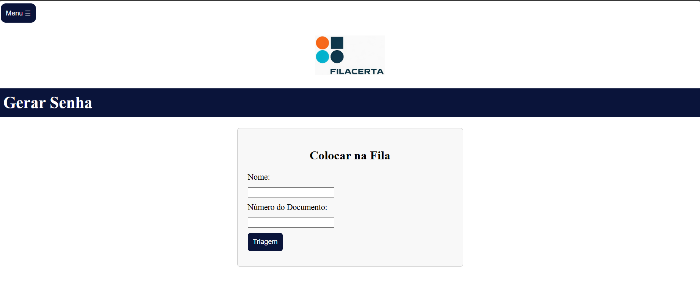
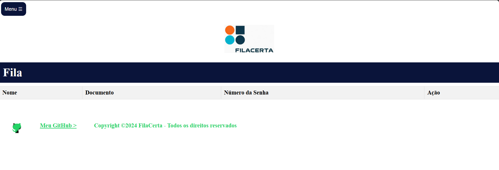
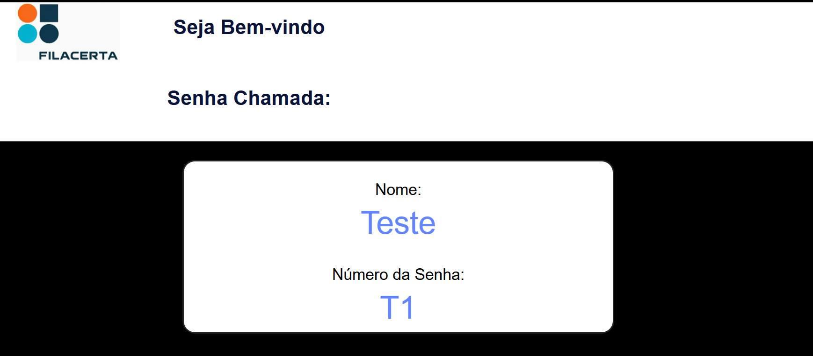
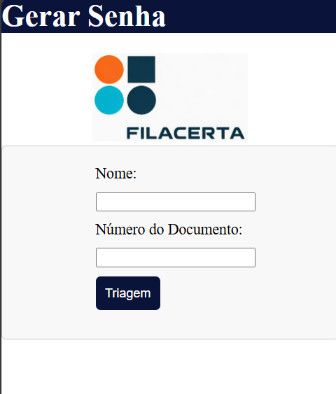
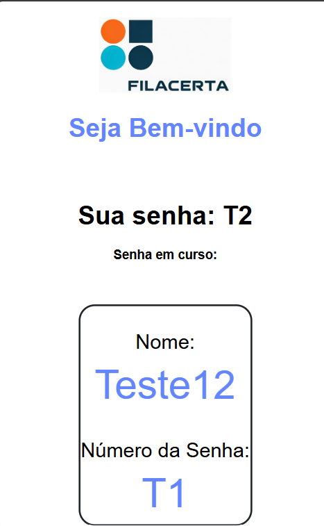

# FilaCerta-Painel-senha
<br />
<p align="center">
  </a>
</img>
  </a>

  <h3 align="center">Sistema de Gerenciamentos de Senha</h3>

  <p align="center">
    Solução fácil para problemas de filas presenciais
  </p>
</p>

---

## Sobre o projeto
este projeto permite gerar tickets para uma pessoa, com seu nome e número do documento, para que você possa ligar para o painel, conforme a necessidade do momento, ao fazer a ligação ele é automaticamente redirecionado para o painel de visualização de tickets, assim jogando um efeito sonoro para que a pessoa saiba que você ligou para ela.

<br />

É utilizada uma API construída em Flask para cadastrar novo ticket na fila e chamar a próxima pessoa na fila.

---

### Construído com

* [Python](https://python.org)

---

### Triagem de fila da web
Aqui é onde podemos colocar os dados da pessoa para ligarmos mais tarde.

<br />

<p align="center">
</a>
</img>
</a>
</p>
<br />
Depois disso podemos ver o ticket gerado para a pessoa, podemos chamar o ticket em qualquer ordem.

<br />
<br />

<p align="center">
</a>
</img>
</a>
</p>

---

### Visualização da fila da Web
Depois de chamarmos o ticket, temos que ver o ticket chamado e ver que tem a visualização da fila web, aqui é onde podemos ver o número marcado e o nome da pessoa chamada. Após cada chamada marcada, há um efeito de música para alertar que o painel web está ligando para alguém.
<br />

<p align="center">
</a>
</img>
</a>
</p>

---

### Totem Smartphone

Isto pode ser utilizado para que o usuário obtenha sua senha, gerando com seu nome e número do documento,

<br>
<p align="center">
</a>
</img>
</a>
<br>

</p> após isso a pessoa tem acesso a um painel que somente ela, que gerou o ticket, pode visualizar, quando a senha é chamada e o ticket que está segurando é igual ao que foi chamado, a tela começa a pulsar para alertar o usuário.


<br>

<p align="center">
</a>
</img>
</a>


---

### Como iniciar o servidor?

Primeiro acesse o diretório onde está o arquivo no seu prompt, e instale as dependências com:
```
pip install -r requirements.txt
```
Agora é só iniciar o **main.py**

e acesse seu navegador, as portas para as aplicações são:

- *machine_ip*:5001 <br>  
  é o servidor API

- *machine_ip*:5001 <br>  
  A visualização da fila da Web é

- *machine_ip*:5002 <br>
  A fila da Web é triagem <a href="http://localhost:5002/"> Clique aqui para ir para o Início </a> 
  
- *machine_ip*:5003 <br>
  É o Celular Totem

  Caso não acesse tente verificar as configurações do seu firewall para que
  possa liberar essas portas!

---